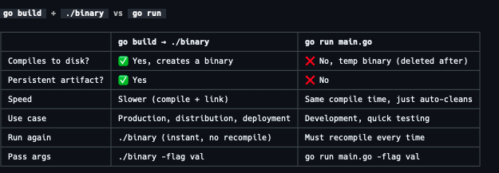

# Setting up your Go environment


Mac
- brew install go

- go env // shows the environment variables related to Go


```
tar -C /user/local -xzf go1.26.0.darwin-arm64.tar.gz
echo "export PATH=$PATH:/usr/local/go/bin" >> ~/.zshrc or ~/.bash_profile
source ~/.zshrc or source ~/.bash_profile
```

Check Go Version

```
mac@Macs-MacBook-Pro-4 ~ % go version
go version go1.26.0 darwin/arm64
```

Troubleshooting
- If you have an older version of Go installed, you may need to uninstall it before installing the new version. You can do this by running `sudo rm -rf /usr/local/go`
- if you get error on version check, make sure to restart your terminal or run `source ~/.zshrc` or `source ~/.bash_profile` to reload the environment variables.
- Make sure PATH variable is set correctly by running `echo $PATH` and checking if `/usr/local/go/bin` is included in the output.


## Go Tooling
- go version -> check version of go
- go build -> compiler  
- go fmt -> code formatter
- go mod -> dependency manager
- scans common coding mistakes -> go vet


Initialize a new module

```
go mod init <module-name> // initializes a new module
```

Go project is called a module. A module is a collection of related Go packages that are versioned together as a single unit. It is defined by a `go.mod` file, which contains `metadata` about the module, including its name, version, and dependencies.

- It is not source code
- It is exact specification of the module's dependencies and their versions of the code within the module.
- Every module has a `go.mod` file at its root and the file is created when you run the `go mod init`

FYI: #ai
```
 - `go get` command to add or update dependencies within a module. It fetches the specified package and its dependencies, and updates the `go.mod` file accordingly.
```


go.mod file declares
- name of the module
- the version of Go used in the module
- the dependencies required by the module, along with their versions.
 - (Analogy: to package.json in Node.js)
 - (Analogy: to requirements.txt in Python)
 - (Analogy: to Gemfile in Ruby)i


Important:
- Direct modiifcation for `go.mod` file is not recommended. 
- Instead, use the `go get` command to add or update dependencies within a module. 


FYI: Main Package
- `main` package is a special package in Go that serves as the entry point for a Go program. 
- When you run a Go program, the Go runtime looks for the `main` package and executes the `main` function within it.


FYI: Go Imports:
- Go imports complete package
- You can't limit to import specific:
    - functions
    - variables
    - constants
    - types


#### Go Build
- `go build` command is used to compile the source code of a Go program into an executable binary.


AI:

Experimented:

```
go run hello.go  
go build hello.go && ./hello // generates an executable file named `hello` in the current directory, which can be run directly from the command line.


Intresting:

If you run `go build`

Name of Binary file is same as the name of the directory where the source code is located.

Matches: Module Declaration in `go.mod` file

In case you want to compile an applicaiton with a different name, you can use the `-o` flag to specify the output file name. For example, to compile the program and create an executable named `myprogram`, you can run:


Example:
- go build -o myprogram hello.go

```




## Go fmt


- Go doesn't allow any flexibility in formatting the code. It enforces a strict set of formatting rules to ensure that all Go code looks consistent and follows a standard style. 

- This is done using the `gofmt` tool, which automatically formats Go code according to these rules.

- Go Enforcing a standard formatting style helps to improve code readability and maintainability, and makes it easier for developers to collaborate on Go projects.

- Avoid Format wars in between developers in Go
- Avoid debates about braces style, indentation, and other formatting issues in Go code.

FYI: Go Development tool includes `gofmt` tool which can be used to format Go code automatically.


```
go fmt <file-name> // formats the code in the specified file according to the standard Go formatting rules.
```

IMP!
- go fmt won't fix brace on the wrong line issue. 


## Semicolon in Go
- Semicolon is not required at end of each statement in Go.
- Semnicolon is automatically inserted by the Go compiler at the end of each statement during compilation.


## Go Vet
- `go vet` command is a static analysis tool that checks Go code for common mistakes and potential issues that may lead to bugs or unexpected behavior.


## Go Playground
- https://go.dev/play/


## Makefiles

- Go devs has adopted `Makefile` to automate the build and deployment process of Go applications.


- Makefile defines set of operations that can be executed from the command line, such as building the application, running tests, and deploying the application to a server.

- Order in which the operations must be performed is defined in the Makefile.


*Intresting Fact:*

- Makefile has been used to build programs on Unix-like systems for decades, and it is still widely used today in many programming languages, including Go.


```
mac@Macs-MacBook-Pro-4:~/Work/Github/learn/learn-golang/learning-go/chp1 % make
go fmt .
go vet .
go build
```

FYI:
e.g 
- `build: vet` word before colon in Makefile indicates that the `build` target depends on the `vet` target.
-  This means that when you run `make build`, it will first execute the `vet` target before executing the `build` target.

Chain dependencies allow multiple targets to depend on other targets, enabling complex automated build processes via the `make` command.


Cons of Makefile:
- Makefile is not cross-platform, and it may not work on all operating systems or environments
- Windows make needs to be explictly installed e.g `choco install make` or `winget install make`


## Go Compatabilty Promise

- https://go.dev/doc/go1compat


## Go Conference

- https://www.gophercon.eu/
- https://www.gophercon.com/


## Update to New Go Version


- mv /user/local/go /usr/local/go.old
- tar -C /user/local -xzf go1.26.0.linux-amd64.tar.gz
- rm -rf /user/local/go.old 